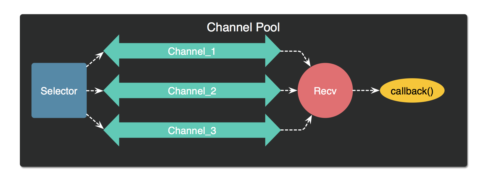

# jelly

弹性channel池，用来接收数据并处理，当数据超出负载设置时扩容，当数据量减少时收缩。



- LoadFactor：负载系数，默认为3(容量右移位数，也可以理解为当前缓存数据到达缓存容量的87.5%时，为满载)

- Selector：用于选择哪条channel来发送数据
- Recv：后台不停调用，接收到值后调用处理函数`callback(v interface{})`
- grow()：当`容量<<负载系数 > 剩余空间`时，增加`option.Step`个channel来减轻当前channel的负载
- shrink()：当收缩`option.Step`个channel后还不会达到满载时，就直接收

**Example:**

```go
func main() {
    var w sync.WaitGroup
	pool, err := NewChanPool(DefaultOption, func(v interface{}) {
        //todo 处理v
        fmt.Println(v)
		w.Done()
	})
	if err != nil {
        panic(err)
	}
	err = pool.StartRecv()
	if err != nil {
		panic(err)
	}
    w.Add(1000)
	for i := 0; i < 5; i++ {
		go func() {
			for i := 0; i < 200; i++ {
                pool.Send(i, true) // Send(值，是否允许阻塞)
			}
		}()
	}
	go func() {
		timer := time.NewTimer(5 * time.Second)
		<-timer.C
		t.Fatal("time out")
	}()
	w.Wait() //等待结束
}
```

